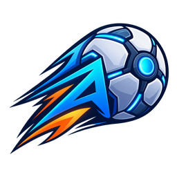
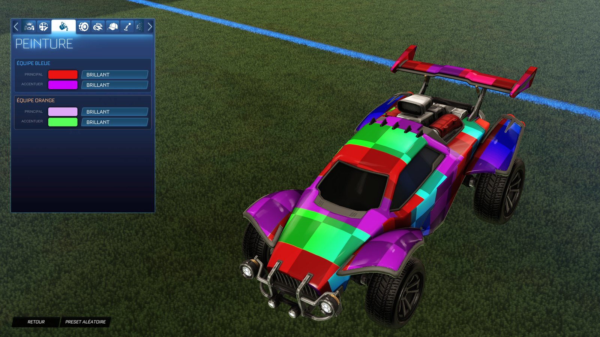

# ALXS-RL-Mod

**Personnalise Rocket League sans injection** — swaps d'items, stickers custom en vraies
couleurs, palettes de couleurs d'équipe, balle custom, maps Workshop, presets et tracker de match.

[**Télécharger**](https://github.com/ALXS-GitHub/ALXS-RL-Mod/releases/latest) ·
[Site](https://alxs-github.github.io/ALXS-RL-Mod/fr/) ·
[English](README.md)

ALXS-RL-Mod est une app de bureau gratuite et open source pour **Rocket League sur PC
(Epic Games)**. Elle ramène ce que les joueurs faisaient avec AlphaConsole et les plugins
BakkesMod (swaps de cosmétiques, stickers custom, balles custom, maps de la communauté) en
travaillant **uniquement sur les fichiers locaux du jeu** : pas d'injection de DLL, pas
d'interception réseau, pas de certificat. Chaque modification est sauvegardée et réversible
en un clic.

## Fonctionnalités

| | |
|---|---|
| **Swaps d'items** | Équipe un item que tu possèdes, vois-en un autre à la place : roues, boosts, stickers, chapeaux, antennes, explosions de but… Le catalogue est construit depuis tes fichiers du jeu. |
| **Stickers custom** | Utilise les packs de stickers au format AlphaConsole. Les stickers *hybrides* gardent l'image avec **ses vraies couleurs** tandis que des zones prennent tes couleurs principale et d'accent (Octane, Dominus, Fennec), plus des stickers **universels** qui vont sur toutes les voitures. |
| **Balle custom** | Mets ta propre image sur la balle standard. |
| **Palettes de couleurs** | Remplace les nuanciers principal et d'accent du jeu par ta propre palette. |
| **Maps Workshop** | Une bibliothèque de maps de la communauté (bakkesplugins, Lethamyr, tes fichiers). Une map remplace une arène Labs, même jeu lancé, et l'originale revient en un clic. |
| **Presets** | Enregistre un loadout complet (swaps, palette, sticker, map) et passe de l'un à l'autre en un clic ; partage-le avec un code. |
| **Tracker de match** | Bilan de session, match en direct et overlay en jeu via la Stats API officielle du jeu. MMR et rangs du lobby via tracker.gg en option. |
| **Import BakkesMod** | Récupère tes maps Workshop, tes packs de stickers AlphaConsole et tes balles, convertis en stickers en vraies couleurs si tu veux. |
| **Sûr par conception** | Sauvegarde de chaque fichier, « restaurer le jeu d'origine » en un clic, reconstruction automatique après une mise à jour du jeu, mises à jour automatiques de l'app. |

## Installation

1. Télécharge le dernier `ALXS-RL-Mod_x.y.z_x64-setup.exe` dans les
   [Releases](https://github.com/ALXS-GitHub/ALXS-RL-Mod/releases/latest) et lance-le.
   L'installeur n'est pas encore signé : si Windows SmartScreen s'affiche, clique sur
   *Informations complémentaires* → *Exécuter quand même*.
2. Lance l'app : elle trouve ton installation Epic Games de Rocket League.
3. Importe un `keys.txt` (voir ci-dessous) pour activer les swaps, les stickers et la balle.
   Les maps, les palettes et le tracker marchent sans.

L'app se met à jour toute seule à chaque nouvelle version.

### À propos de `keys.txt`

Rocket League chiffre une partie de ses packages. Pour lire et échanger des items, il faut
les clés AES de ces packages, une clé base64 par ligne, dans un fichier `keys.txt`.
**L'app ne fournit pas ces clés.** Elles sont partagées par la communauté de modding Rocket
League (par exemple avec des outils de packages comme RLUPKTool). Récupère un fichier à jour,
puis importe-le depuis l'écran d'accueil ou *Réglages → Fichiers du jeu*. Après une mise à
jour du jeu, les nouveaux items peuvent demander un fichier plus récent.

## FAQ

**Est-ce que je risque un ban ?** ALXS-RL-Mod n'injecte jamais de code dans le jeu et ne
touche pas à son trafic réseau ; elle modifie seulement des fichiers locaux, et toi seul vois
le résultat. Modifier les fichiers du jeu va quand même à l'encontre de ses conditions
d'utilisation : utilise-la à tes risques.

**Steam ou console ?** Windows avec la version Epic Games uniquement pour l'instant.

**Le jeu s'est mis à jour et mes mods ont disparu.** L'app détecte la mise à jour et
reconstruit automatiquement swaps, palette, stickers et balle (désactivable dans les Réglages).

**Comment tout enlever ?** *Réglages → Restaurer le jeu d'origine*, ou désinstalle
simplement l'app : le désinstalleur remet d'abord les fichiers d'origine.

## Compiler depuis les sources

Voir la section *Build from source* du [README anglais](README.md#build-from-source).

## Avertissement

ALXS-RL-Mod est un projet de fan. Il n'est ni affilié, ni approuvé, ni sponsorisé par Psyonix
ou Epic Games. Rocket League et ses éléments sont des marques de Psyonix LLC. L'app ne
distribue aucun fichier du jeu ni aucune clé de chiffrement.

## Licence

[GPL-3.0-or-later](LICENSE) © ALXS
