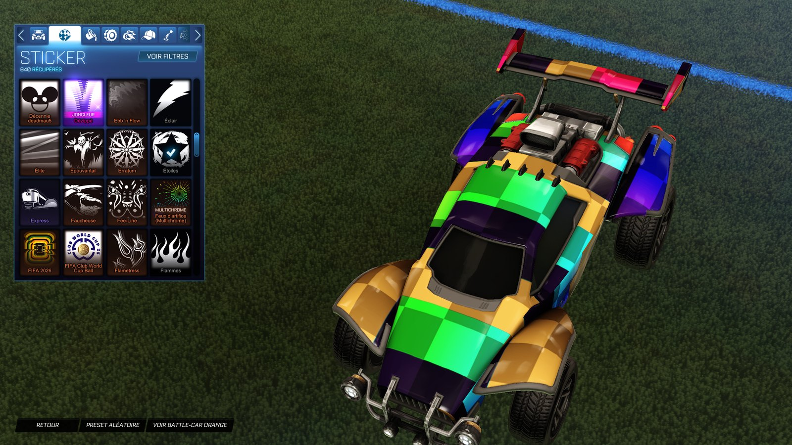

<div align="center">


# ALXS-RL-Mod

**Customize Rocket League without injection** — item swaps, custom decals in real colors,
team color palettes, a custom ball, Workshop maps, presets and a live match tracker.

[](https://github.com/ALXS-GitHub/ALXS-RL-Mod/releases/latest)
[](https://github.com/ALXS-GitHub/ALXS-RL-Mod/releases)
[](LICENSE)
-0a0f1f)


[**Download**](https://github.com/ALXS-GitHub/ALXS-RL-Mod/releases/latest) ·
[Website](https://alxs-github.github.io/ALXS-RL-Mod/) ·
[Français](README.fr.md)


</div>

ALXS-RL-Mod is a free, open-source desktop app for **Rocket League on PC (Epic Games)**. It
brings back what players used AlphaConsole and BakkesMod plugins for — cosmetic swaps,
custom decals, custom balls, community maps — by working **only on your local game files**:
no DLL injection, no network interception, no certificates. Every change is backed up and
can be undone in one click.

## Features

| | |
|---|---|
| **Item swaps** | Equip an item you own, see any other one instead: wheels, boosts, decals, toppers, antennas, goal explosions and more. The catalog is built from your own game files. |
| **Custom decals** | Use AlphaConsole-style decal packs. *Hybrid* decals keep the image in its **own colors** while chosen zones take your primary and accent colors (Octane, Dominus, Fennec), plus **universal** decals that fit every car. |
| **Custom ball** | Put your own image on the standard ball. |
| **Color palettes** | Replace the game's primary and accent color pickers with your own palette. |
| **Workshop maps** | A library of community maps (bakkesplugins, Lethamyr, your own files). A map replaces a Labs arena, even while the game runs, and the original comes back in one click. |
| **Presets** | Save a whole loadout (swaps, palette, decal, map) and switch in one click; share it with a code. |
| **Match tracker** | Session record, live match and an in-game overlay from the game's official Stats API. Optional MMR and lobby ranks from tracker.gg. |
| **BakkesMod import** | Bring your Workshop maps, AlphaConsole decal packs and balls into the app, converted to real-color decals if you want. |
| **Safe by design** | Backups for every file, "restore the stock game" in one click, automatic rebuild after game updates, auto-updates of the app itself. |



## How it works

Rocket League loads cosmetics from cooked `.upk` packages. ALXS-RL-Mod rebuilds the few
packages you customize (same size, same structure, a renamed donor where needed) and drops
them where the game looks for overrides, or writes your texture into a small cache file of
its own. The originals are kept in a backup folder and restored on demand, after a game
update or when you uninstall the app.

**Only you see your changes**: other players see your real items.

## Install

1. Download the latest `ALXS-RL-Mod_x.y.z_x64-setup.exe` from
   [Releases](https://github.com/ALXS-GitHub/ALXS-RL-Mod/releases/latest) and run it.
   The installer is not code-signed yet: if Windows SmartScreen shows up, click
   *More info* → *Run anyway*.
2. Start the app: it finds your Epic Games install of Rocket League.
3. Import a `keys.txt` (see below) to enable item swaps, decals and the ball. Maps, palettes
   and the tracker work without it.

The app updates itself when a new version is released.

### About `keys.txt`

Rocket League encrypts part of its packages. Reading and swapping items needs the AES keys
of those packages, one base64 key per line, in a `keys.txt` file. **The app does not ship
these keys.** They are shared by the Rocket League modding community (for example alongside
package tools such as RLUPKTool). Get an up-to-date file, then import it from the welcome
screen or *Settings → Game files*. After a game update, new items may need a newer file.

## FAQ

**Can I get banned?** ALXS-RL-Mod never injects code into the game and never touches its
network traffic; it only edits local files, and only you see the result. Still, modifying
game files goes against the game's terms of use: use it at your own risk.

**Does it work with Steam or on console?** Windows with the Epic Games version only for now.

**The game updated and my mods are gone.** The app notices the update and rebuilds swaps,
palette, decals and ball automatically (you can turn that off in Settings).

**How do I remove everything?** *Settings → Restore the stock game*, or simply uninstall
the app: the uninstaller puts the original files back first.

**Where are my files?** `%LOCALAPPDATA%\ALXS-RL-Mod` (backups, libraries, logs, settings).
Nothing is sent anywhere; network calls only happen when you download a map, look up a
rank on tracker.gg (optional) or check for app updates.

## Build from source

Requirements: [Bun](https://bun.sh), [Rust](https://rustup.rs) (stable) and the
[Tauri prerequisites](https://v2.tauri.app/start/prerequisites/) for Windows.

```sh
bun install
bun run app        # development build with hot reload
bun run prod       # release build + NSIS installer
bun run typecheck && bun run lint && (cd src-tauri && cargo test)
```

For development, drop your `keys.txt` at `src-tauri/resources/keys/keys.txt` (ignored by git).
Architecture and conventions: [docs/ARCHITECTURE.md](docs/ARCHITECTURE.md). Reverse-engineering
notes on the game's formats: [docs_rl/](docs_rl/).

**Stack:** Tauri 2 · Rust · React 19 · TypeScript · Vite · Tailwind CSS 4 · TanStack Router & Query.

## Contributing

Issues and pull requests are welcome. For a bug, attach the diagnostics bundle
(*Settings → Diagnostics bundle*) and, if the game crashed, its log (*Settings → Logs*).
Never share your `keys.txt`.

## Credits

- AlphaConsole and its community of pack creators for the decal pack format.
- The Rocket League modding community for the package format research and tools (RLUPKTool).
- [bakkesplugins.com](https://bakkesplugins.com) and [Lethamyr](https://lethamyr.com) for the community maps.
- [tracker.gg](https://rocketleague.tracker.network) for public rank data (optional feature).

## Disclaimer

ALXS-RL-Mod is a fan-made project. It is not affiliated with, endorsed, sponsored or approved
by Psyonix or Epic Games. Rocket League and its assets are trademarks or registered trademarks
of Psyonix LLC. The app ships no game files and no encryption keys.

## License

[GPL-3.0-or-later](LICENSE) © ALXS
